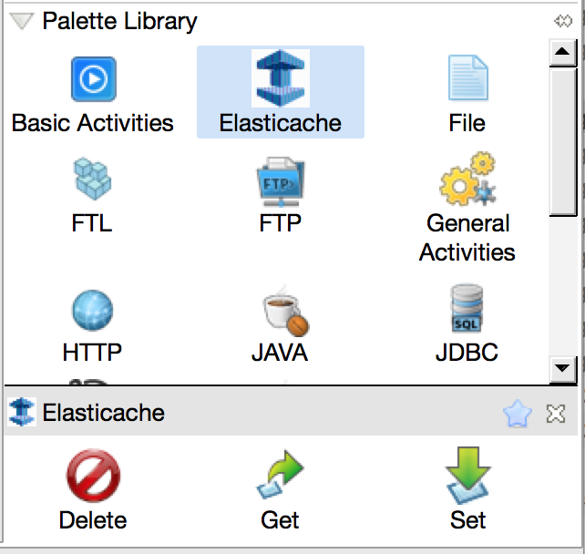
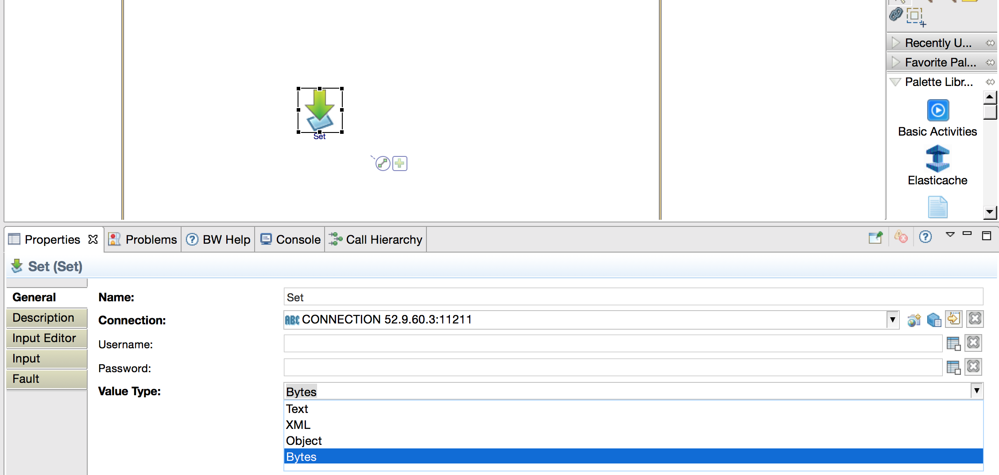
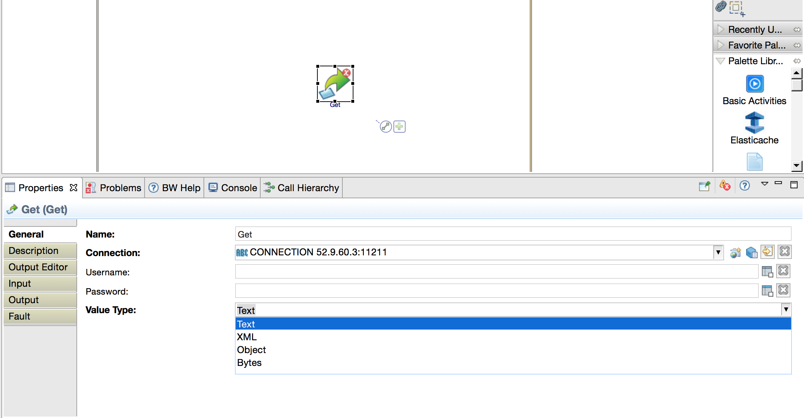
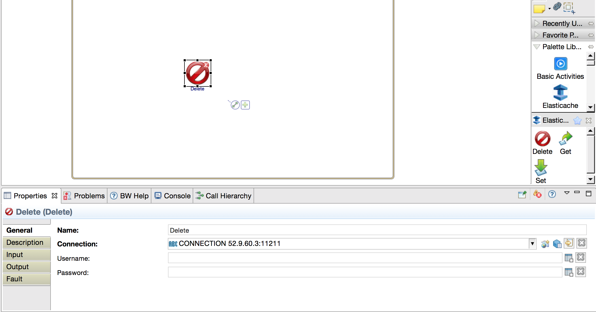

# TCI-Hackathon
TCI Hackathon 2016

##ElastiCache Palette

ElastiCache is a specification about in memory data storage of applications in a Java environment. The ElastiCache palette is used to set, get and delete data in a process. It uses AWS(memcache) as a datastore.
For more information about AWS ElastiCache adn its configuration. Please refer to:
https://docs.aws.amazon.com/AmazonElastiCache/latest/UserGuide/GettingStarted.html

##Operations supported:

 * Set: Store or Update Text, Bytes, Objects or XML data into memcache with a key and an expiration duration.
 * Get: Get the data from memcache with a key
 * Delete: Delete the data from memcache with a key
 

## Set Activity:

## Get Activity:

## Delete Activity:

